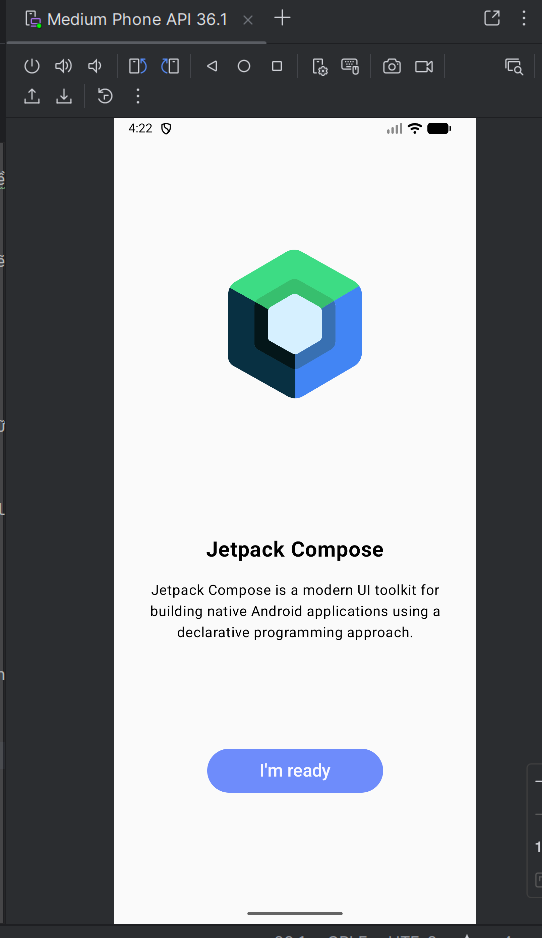
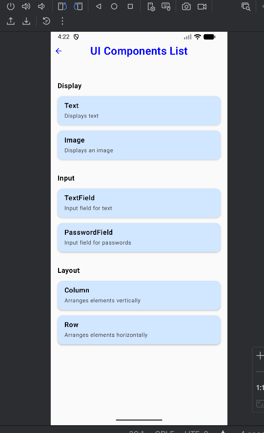
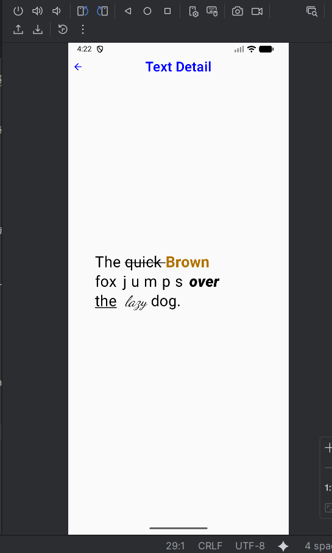
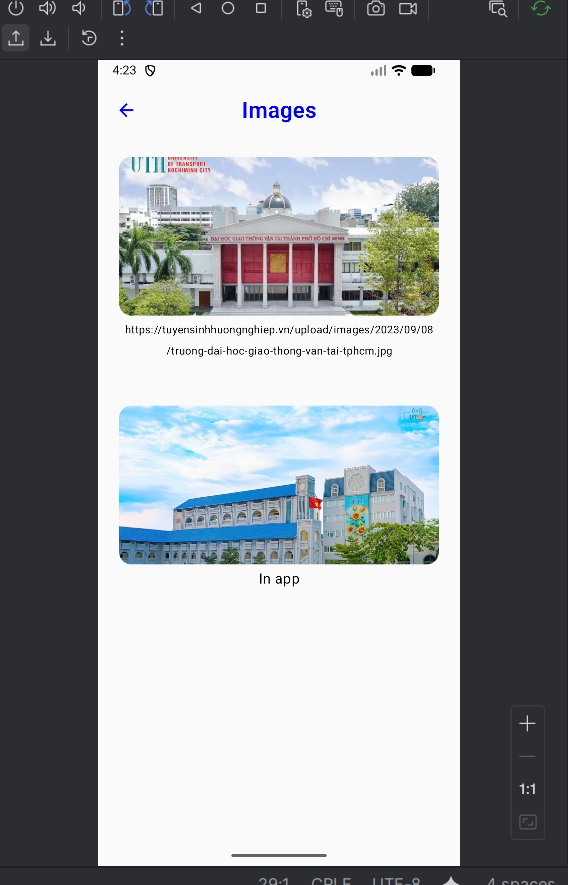
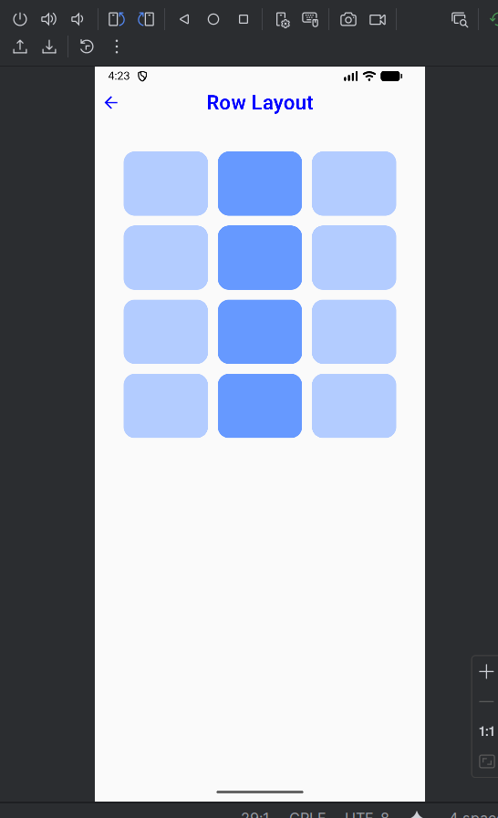
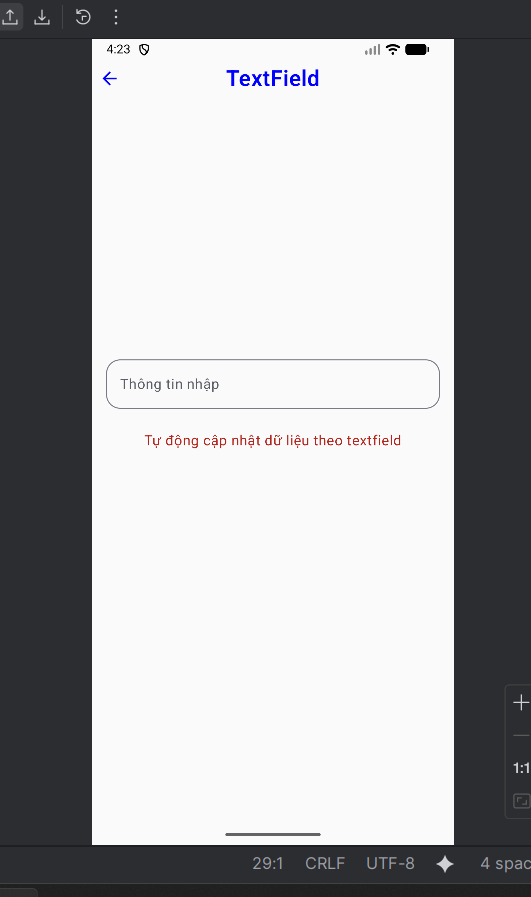

# ScreenNavigation (Jetpack Compose)

Ứng dụng mẫu điều hướng nhiều màn hình bằng Jetpack Compose.

## Mô tả từng file

- `MainActivity.kt`  
  Khởi tạo Compose, cấu hình `NavHost` và khai báo các route. Điều hướng: **Welcome → Components → (Text / Image / TextField / Row)**.

- `layout/WelcomeScreen.kt`  
  Màn hình chào có logo, mô tả ngắn, nút “I’m ready”. Nhấn nút sẽ điều hướng sang **ComponentScreen**.

- `layout/ComponentScreen.kt`  
  Danh sách các thành phần UI cơ bản, chia nhóm *Display / Input / Layout*. Chỉ mục có callback mới điều hướng sang màn tương ứng.

- `layout/TextScreen.kt`  
  Minh họa định dạng chữ: gạch ngang, in đậm, gạch chân, giãn chữ, và áp dụng font tùy chỉnh cho từ “lazy”.

- `layout/ImageScreen.kt`  
  Hiển thị ảnh từ **web** bằng Coil (`AsyncImage`) và ảnh **local** bằng `painterResource`. Có tiêu đề và nút về trước.

- `layout/TextFieldScreen.kt`  
  Ô nhập `OutlinedTextField`, hiển thị dòng trạng thái/hướng dẫn bên dưới, cập nhật giá trị theo thời gian thực.

- `layout/RowLayoutScreen.kt`  
  Minh họa bố cục hàng (Row) theo dạng lưới nhỏ 3 cột × nhiều hàng, khác biệt với Column.
 
