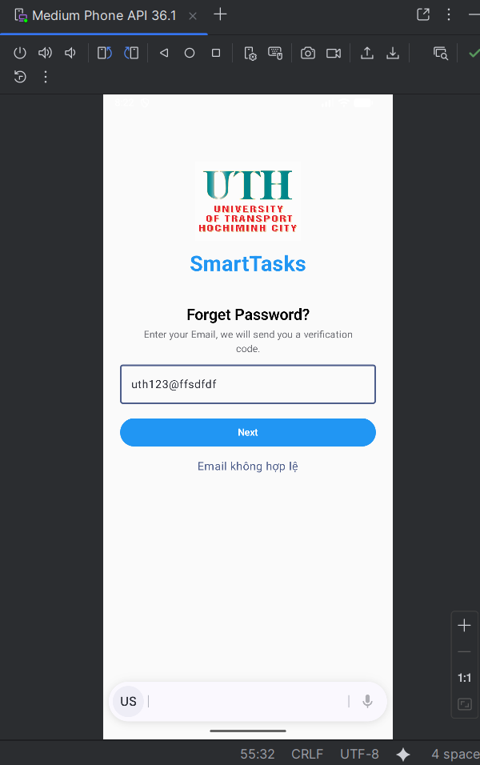
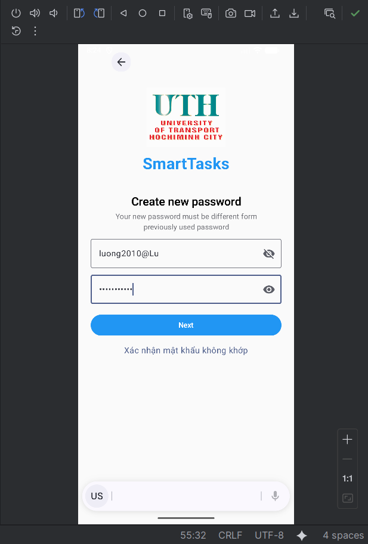

# Giải thích các file và hàm chính có trong bài tập
---

## MainActivity.kt
- **onCreate()**  
  Khởi tạo giao diện Compose, áp dụng SmartTasksTheme, tạo PasswordFlowViewModel và chạy AppNavGraph.

---

## navigation/NavRoutes.kt
  FORGOT, VERIFY, RESET, CONFIRM – dùng để định danh các màn hình trong Navigation Compose.

## navigation/AppNavGraph.kt
- **AppNavGraph(viewModel)**  
  Khai báo NavHost và các composable tương ứng.  
  Liên kết các màn hình với PasswordFlowViewModel, điều hướng tuần tự:
    1. ForgotPasswordScreen
    2. VerifyCodeScreen
    3. ResetPasswordScreen
    4. ConfirmScreen  
       Khi Submit ở ConfirmScreen, hệ thống quay về Forgot và hiển thị lại thông tin đã xác nhận.

---

## presentation/PasswordFlowViewModel.kt
### Data class
- **FlowUiState** – lưu trữ trạng thái giao diện (email, otp, password, confirmPassword, loading, error).
- **ConfirmedInfo** – chứa thông tin cuối cùng sau khi người dùng xác nhận (email, otp, password) để hiển thị lại ở màn đầu.

### ViewModel
- **PasswordFlowViewModel(repo)** – quản lý toàn bộ logic luồng quên mật khẩu, gọi các UseCase, cập nhật state.

### Hàm cập nhật dữ liệu
- updateEmail(v) – cập nhật email.
- updateOtp(v) – cập nhật OTP, giới hạn tối đa 5 ký tự số.
- updatePassword(v) – cập nhật mật khẩu.
- updateConfirmPassword(v) – cập nhật xác nhận mật khẩu.

### Hàm xử lý chính
- requestReset(onSuccess) – kiểm tra email, gọi RequestResetUseCase, bật/tắt loading, điều hướng sang màn Verify.
- verifyOtp(onSuccess) – kiểm tra định dạng OTP (chỉ số, ≤5 ký tự), gọi VerifyOtpUseCase, chuyển sang Reset.
- validateLocalForConfirm(onValid) – kiểm tra mật khẩu mạnh & trùng khớp trước khi sang Confirm.
- submitAll(onSuccess) – gửi yêu cầu đổi mật khẩu (UpdatePasswordUseCase), lưu lastConfirmed, reset state, quay lại Forgot.

---

## domain/UseCases.kt
- **RequestResetUseCase(repo)** – gửi yêu cầu reset mật khẩu (nhận OTP).
- **VerifyOtpUseCase(repo)** – xác thực mã OTP.
- **UpdatePasswordUseCase(repo)** – cập nhật mật khẩu mới.

---

## data/AuthRepository.kt
- **AuthRepository (interface)** – chuẩn hóa các hành động:  
  requestPasswordReset(), verifyOtp(), updatePassword().
- **FakeAuthRepository (mock)** – mô phỏng hoạt động:
    - requestPasswordReset – giả lập gửi OTP (lưu "12345").
    - verifyOtp – cho phép mọi OTP hợp lệ (chỉ kiểm tra định dạng).
    - updatePassword – giả lập thành công, xóa OTP khỏi bộ nhớ.

---

## screens/ForgotPasswordScreen.kt
- **ForgotPasswordScreen(state, lastConfirm, onEmailChange, onNext)**  
  Màn hình nhập email để nhận OTP.  
  Nếu có lastConfirm, hiển thị thẻ “Last confirmed” gồm:
    - Email
    - OTP
    - Password (có nút ẩn/hiện).

---

## screens/VerifyCodeScreen.kt
- **VerifyCodeScreen(state, onBack, onOtpChange, onNext)**  
  Màn hình nhập mã OTP bằng OtpField.  
  Nút Next được bật khi OTP không rỗng (≤5 ký tự).

---

## screens/ResetPasswordScreen.kt
- **ResetPasswordScreen(state, onBack, onPasswordChange, onConfirmPasswordChange, onNext)**  
  Màn hình nhập và xác nhận mật khẩu mới.  
  Hỗ trợ ẩn/hiện mật khẩu.  
  Khi nhấn Next, ViewModel kiểm tra hợp lệ rồi chuyển đến Confirm.

---

## screens/ConfirmScreen.kt
- **ConfirmScreen(state, onBack, onSubmit)**  
  Màn hình xác nhận lại Email – OTP – Password trước khi hoàn tất.  
  Trường mật khẩu có nút ẩn/hiện.  
  Khi nhấn Submit, gửi dữ liệu, lưu lastConfirmed và quay về Forgot.

---

## ui/components/AppHeader.kt
- **AppHeader(title, subtitle, showBack, onBack)**  
  Header chung có logo UTH, tiêu đề phụ SmartTasks, và nút quay lại (ẩn ở màn đầu).

## ui/components/BackIcon.kt
- **BackIcon(onBack)**  
  Icon tròn chứa mũi tên quay lại, dùng trong AppHeader.

## ui/components/FormTextField.kt
- **EmailField(value, onValueChange, placeholder)** – ô nhập email.
- **PasswordField(value, onValueChange, placeholder)** – ô nhập mật khẩu có nút ẩn/hiện.

## ui/components/OtpField.kt
- **OtpField(value, onValueChange, boxCount = 5)**  
  Trường nhập OTP gồm tối đa 5 ô; nhận dữ liệu số, hiển thị ký tự trong các box.

## ui/components/PrimaryButton.kt
- **PrimaryButton(text, enabled = true, onClick)**  
  Nút hành động chính (màu xanh) dùng ở các màn hình.

---

## util/Validators.kt
- **isValidEmail(s)** – kiểm tra định dạng email.
- **isValidOtp(s)** – OTP không rỗng, chỉ số, tối đa 5 ký tự.
- **isStrongPassword(s)** – mật khẩu ≥8 ký tự, có chữ hoa, chữ thường, và số.

---

