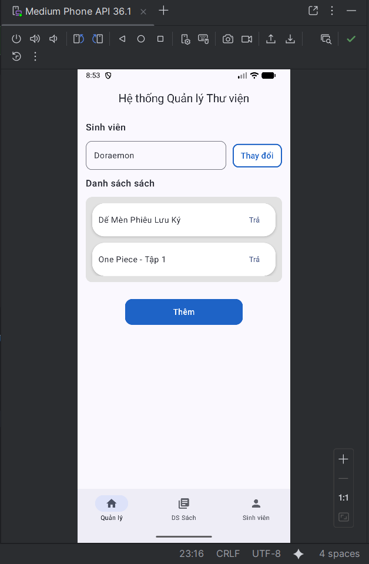
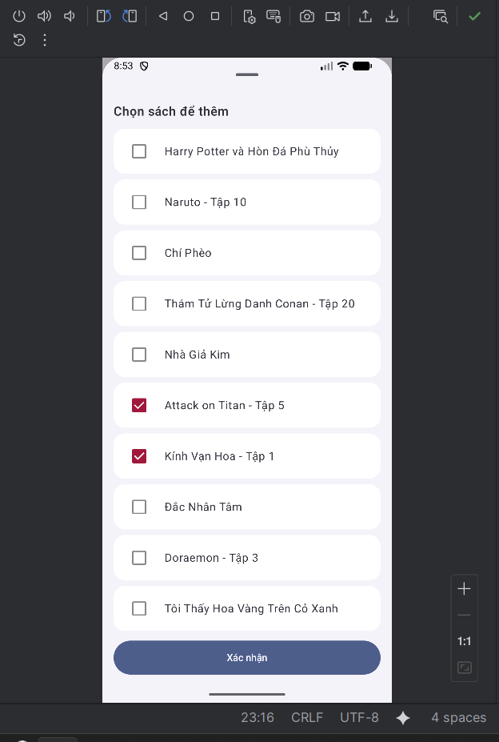
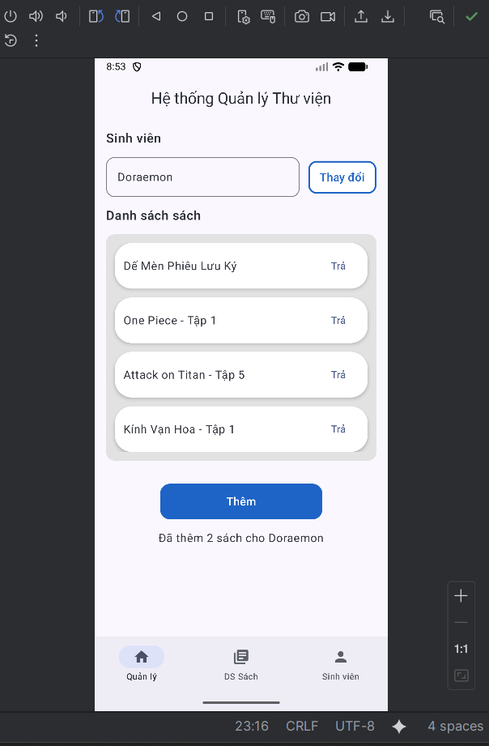
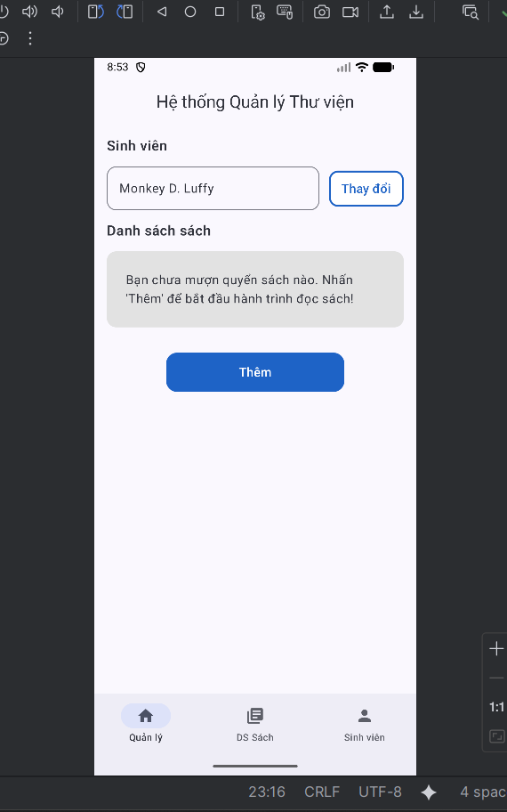
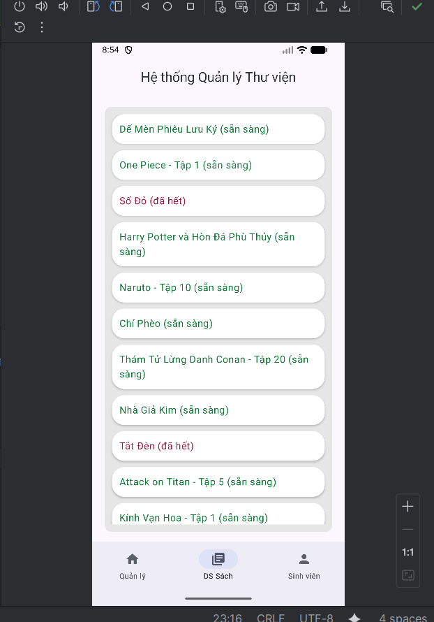
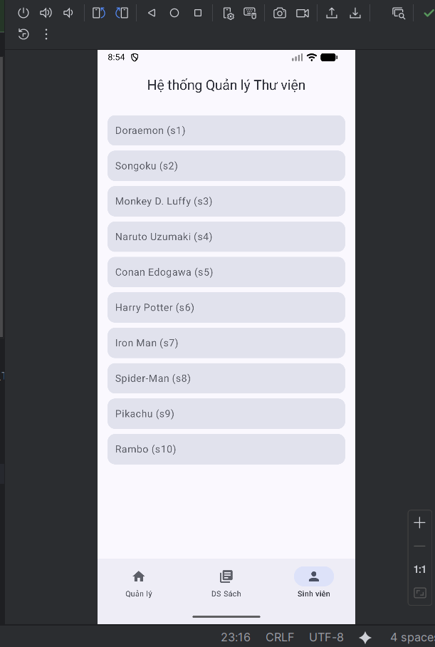

# HTQuanLyThuVien

---

## 1. ui.theme

### MainActivity.kt
- **onCreate()**: Hàm khởi động ứng dụng, gọi `setContent` để hiển thị nội dung chính.
- Sử dụng `HTQuanLyThuVienTheme` để áp dụng giao diện tổng thể và gọi `MainApp()` để hiển thị phần điều hướng chính.

### MainApp.kt
- **MainApp()**: Hàm gốc điều hướng toàn app, chứa `Scaffold` gồm `Header`, `AppNavHost` và `BottomBar`.
- Tạo cấu trúc chính của giao diện, quản lý header và thanh điều hướng dưới.

---

## 2. components

### Header.kt
- **Header()**: Thành phần tiêu đề hiển thị tên hệ thống "Hệ thống Quản lý Thư viện". Dùng lại trên tất cả các màn hình thông qua Scaffold.

### BottomBar.kt
- **BottomBar()**: Thanh điều hướng dưới cùng, có 3 tab: “Quản lý”, “DS Sách”, “Sinh viên”. Cho phép người dùng chuyển giữa các màn hình chính.

### Others.kt
- Chứa các hàm UI phụ trợ như `EmptyState()` hoặc `BookUi()`.
- Dùng để gom các thành phần nhỏ, tái sử dụng trong nhiều màn hình.

---

## 3. navigation

### AppNavHost.kt
- **AppNavHost()**: Định nghĩa hệ thống điều hướng của Compose.
- Liên kết các route từ `Routes` đến các màn hình: `ManagementScreen`, `BooksScreen`, `StudentsScreen`.

### Routes.kt
- Chứa hằng số định danh route cho các màn hình:
    - `MANAGEMENT`, `BOOKS`, `STUDENTS`.

---

## 4. data.models

### Models.kt
- **data class Book**: Lưu thông tin sách (`id`, `title`, `available`).
- **data class Student**: Lưu thông tin sinh viên (`id`, `name`).
- **data class BorrowRecord**: (tuỳ chọn) ghi lại lịch sử mượn sách (`studentId`, `bookId`, `borrowedAt`, `returnedAt`).

---

## 5. data.fake

### InMemoryStore.kt
- Chứa dữ liệu giả lập trong bộ nhớ:
    - `students`: danh sách sinh viên.
    - `books`: danh sách sách.
    - `borrowedByStudent`: ánh xạ studentId → set(bookId) đang mượn.
- Là nơi lưu trữ dữ liệu chính cho repository giả lập.

### FakeBookRepository.kt
- **getAll()**: Trả toàn bộ danh sách sách.
- **getBorrowedByStudent(studentId)**: Trả danh sách sách SV đang mượn.
- **getAvailableForStudent(studentId)**: Trả danh sách sách còn có thể mượn (chưa ai mượn và có `available = true`).
- **borrowBooks(studentId, bookIds)**: Gán sách cho SV (mượn sách).
- **returnBook(studentId, bookId)**: Trả sách.

### FakeStudentRepository.kt
- **getAll()**: Trả toàn bộ danh sách sinh viên.
- **getFirstOrNull()**: Lấy sinh viên đầu tiên (dùng làm mặc định ban đầu).

---

## 6. data.repository

### BookRepository.kt
- Interface định nghĩa hành vi cho dữ liệu sách:
    - `getAll()`, `getBorrowedByStudent()`, `getAvailableForStudent()`, `borrowBooks()`, `returnBook()`.

### StudentRepository.kt
- Interface định nghĩa hành vi cho dữ liệu sinh viên:
    - `getAll()`, `getFirstOrNull()`.

---

## 7. data.di

### ServiceLocator.kt
- Cung cấp thể hiện Repository cho toàn app:
    - `bookRepo` = `FakeBookRepository()`
    - `studentRepo` = `FakeStudentRepository()`
- Giúp ViewModel truy cập dữ liệu mà không phụ thuộc vào lớp cụ thể.

---

## 8. screens.management

### ManagementUiState.kt
- Lưu trữ trạng thái màn hình quản lý:
    - `students`, `selectedStudent`, `borrowed`, `availableToAdd`, `isPickerOpen`, `selectedToAdd`, `message`.

### ManagementViewModel.kt
- Quản lý dữ liệu và hành vi nghiệp vụ:
    - **nextStudent()**: Chuyển sang sinh viên kế tiếp.
    - **openPicker() / closePicker()**: Mở hoặc đóng sheet chọn sách.
    - **toggleSelectToAdd()**: Chọn hoặc bỏ chọn sách.
    - **confirmAdd()**: Thêm sách mới cho SV (gọi qua repository).
    - **returnBook()**: Trả sách.
    - **refreshLists()**: Cập nhật danh sách sách đã mượn và có thể thêm.

### ManagementScreen.kt
- Giao diện quản lý mượn / trả sách.
    - Hiển thị SV đang chọn, danh sách sách đã mượn, nút “Thêm”.
    - Khi nhấn “Thêm”, hiển thị `ModalBottomSheet` để chọn sách.
    - Nút “Xác nhận” gọi `confirmAdd()` trong ViewModel.

---

## 9. screens.books

### BooksUiState.kt
- Lưu danh sách sách hiển thị trên màn “Danh sách sách”.

### BooksViewModel.kt
- Gọi `BookRepository` để

---
# Output:

